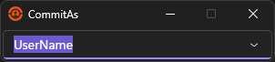

# CommitAs

This tool allows you to quickly change the user of a git repository **during** a commit.



**REMARKS:** This app currently only works on Windows platform. But as it uses [Avalonia UI](https://avaloniaui.net/) for the UI it can be extended to work for other platforms as well.

## Purpose

In our development team we share the usage of PCs connected directly to a hardware development platform. But we want to be able to trak who has done what in out git repository without the need to change the configuration of the git client (for example Visual Studio or [Git Extensions](https://gitextensions.github.io/)). But this tool also works when doing commit directly in the console.

## Functional Principle

*CommitAs* uses two [Git Hooks](https://git-scm.com/book/en/v2/Customizing-Git-Git-Hooks): pre-commit and post-commit.
When ```git commit``` is executed the *pre-commit* hook starts *CommitAs.exe* to change the curren user (name and email) of the repository.
If the user has been changed successfully a dummy file ```_CommitAsTempFile_``` is created.
This file is deleted by the *post-commit* hook. Which then also executes *PostCommitAs.exe* to change the author of the last commit using ```git commit --amend```.

## Usage

__Configure your repository to use *ssl* for push and pull operations.__

Your repository contains a hidden folder ```.git```.
To use the tool download and extract the latest release into the root folder of any repository into the folder ```CommitAs```.
The resulting folder structure should be:
```
.
├── .git
├── CommitAs
│   ├── ...
│   ├── CommitAs.exe
│   ├── PostCommitAs.exe
│   └── ...
...
```
Copy the files ```pre-commit``` and ```post-commit``` from the folder ```CommitAs\hooks``` into the folder ```.git\hooks```.

Thats all. On your next commit you will be prompted to enter the name of the user for which you want to do the commit.

## Configuration

The configuration is saved in ```CommitAsConfig.json```.

This file contains a list of "Users", an "Email", the "CurrentUser", and some command configuartions.
Each user in "Users" has a *Name* and an optional *Email*. The "CurrentUser" is the last user that was selected in *CommitAs.exe*.
If *Email* of the "CurrentUser" is empty the (global) "Email" will be used.

- "CommandPath" is executed before every other command.
- "CommandConfigUserName" is the command that is executed to set the user.name.
- "CommandConfigUserEmail" is the command that is executed to set the user.email.
- "CommandAmend" is the command that is executed by *PastCommitAs.exe*.

__Remark:__ ``{name}`` and ``{email}`` are placeholders for the name and the email of a user.